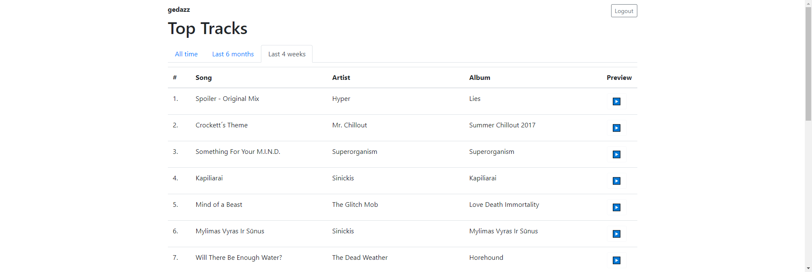

# Awoo

View your top tracks on Spotify.

https://developer.spotify.com/documentation/web-api/reference/personalization/get-users-top-artists-and-tracks/

## Development commands

To start Flask:

1. Create `.env` from `.env.template`
2. `flask run`

To build js files: `yarn` (or `yarn run webpack`)
